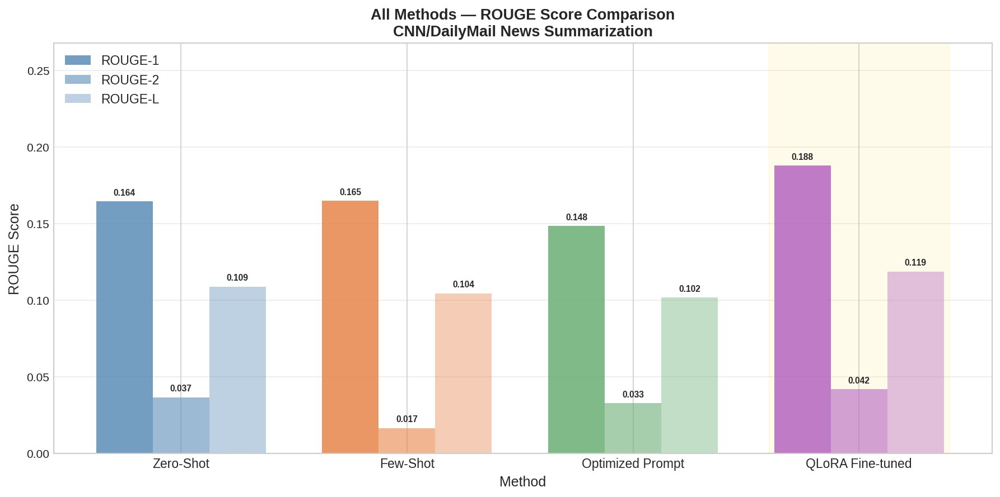
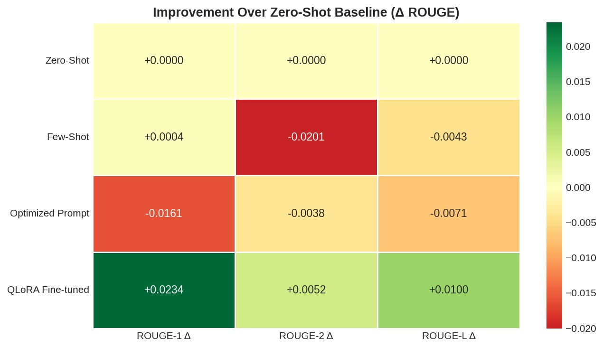
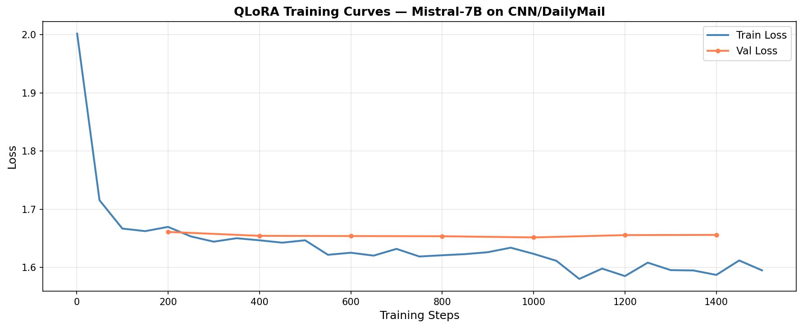
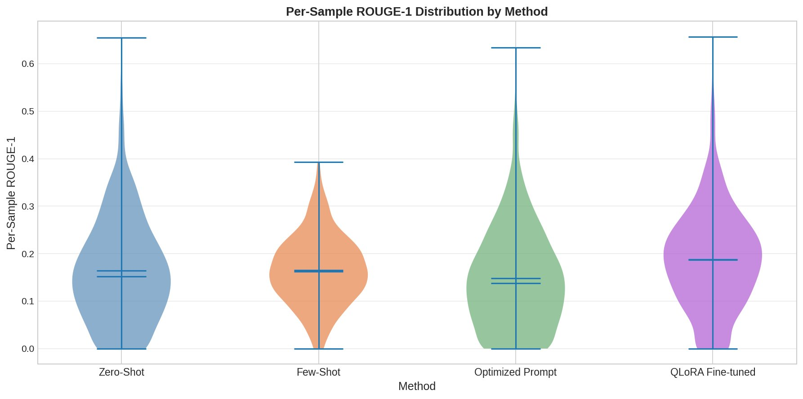
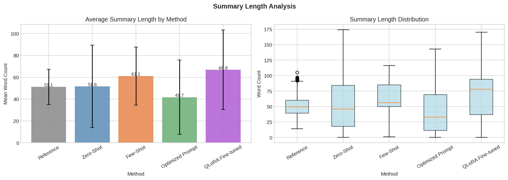
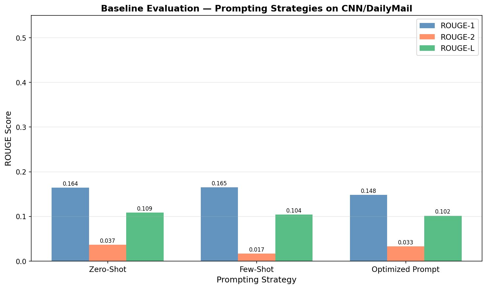
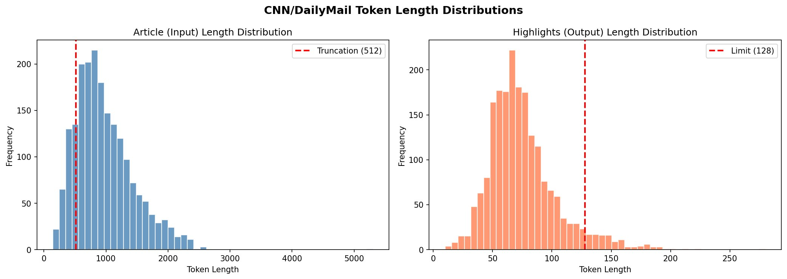

# QLoRA Fine-Tuning for News Summarization
### Mistral-7B on CNN/DailyMail — A Study of Fine-Tuning vs Prompt Engineering


---

## Overview

This project investigates whether **parameter-efficient fine-tuning (QLoRA)** outperforms **prompt engineering** for abstractive news summarization using a 7-billion parameter language model under real hardware constraints (Kaggle free-tier T4 GPU, 15.6 GB VRAM).

The full pipeline spans 4 notebooks — from dataset preparation through ablation study — comparing Zero-Shot, Few-Shot, Optimized Prompt, and QLoRA Fine-tuned approaches, all evaluated on 1,000 held-out CNN/DailyMail test samples using ROUGE metrics and statistical significance testing.

**Key finding: QLoRA fine-tuning achieves the best ROUGE-1 score (0.188) — a statistically significant +14.2% improvement over zero-shot baseline (p < 0.0001).**

---

## Results at a Glance

| Method | ROUGE-1 | ROUGE-2 | ROUGE-L | vs Zero-Shot |
|--------|---------|---------|---------|--------------|
| Zero-Shot | 0.1645 | 0.0367 | 0.1088 | — |
| Few-Shot | 0.1649 | 0.0167 | 0.1045 | +0.0004 (p=0.93, n.s.) |
| Optimized Prompt | 0.1484 | 0.0329 | 0.1017 | -0.0161 (p<0.001) |
| **QLoRA Fine-tuned** | **0.1879** | **0.0420** | **0.1188** | **+0.0234 (p<0.0001 ✓)** |

> Statistical significance tested via paired t-test on per-sample ROUGE-1 scores across 1,000 test examples.

---

## Visual Results

### Ablation Study — All Methods Compared


### Improvement Over Zero-Shot Baseline


### QLoRA Training Curves — Mistral-7B


### Per-Sample ROUGE-1 Distribution


### Summary Length Analysis


### Baseline Prompting Strategies


### Dataset Token Length Distributions


---

## Project Structure

```
qlora-news-summarization/
│
├── notebooks/
│   ├── 01_setup_and_data.ipynb        # Dataset prep, EDA, tokenization analysis
│   ├── 02_baseline_evaluation.ipynb   # Zero-shot, Few-shot, Optimized prompt eval
│   ├── 03_qlora_finetuning.ipynb      # QLoRA training on Mistral-7B (3 epochs)
│   └── 04_ablation_study.ipynb        # Full comparison + statistical testing
│
├── results/
│   ├── images/
│   │   ├── token_distributions.png    # Dataset EDA
│   │   ├── baseline_comparison.png    # Prompting strategy ROUGE scores
│   │   ├── training_curves.png        # Train/val loss over 1500 steps
│   │   ├── rouge_comparison.png       # All methods side-by-side
│   │   ├── ablation_summary.png       # 4-panel ablation dashboard
│   │   ├── improvement_heatmap.png    # Delta ROUGE vs zero-shot
│   │   ├── rouge_distribution.png     # Per-sample violin plots
│   │   └── length_analysis.png        # Summary length by method
│   │
│   └── data/
│       ├── dataset_stats.json         # CNN/DailyMail split statistics
│       ├── baseline_results.csv       # ROUGE scores for prompt methods
│       ├── finetuned_results.csv      # ROUGE scores for QLoRA model
│       ├── finetuned_predictions.csv  # All 1000 predictions + references
│       ├── training_summary.json      # Full training config + final scores
│       └── ablation_summary.json      # Complete ablation results + stats
│
└── README.md
```

---

## Methodology

### Dataset
- **CNN/DailyMail** (v3.0.0) — standard news summarization benchmark
- 8,000 training / 1,000 validation / 1,000 test samples
- Avg article: ~342 words | Avg summary: ~50 words
- Input truncated to 512 tokens; output capped at 128 tokens

### Model
- **Mistral-7B-v0.1** — 7 billion parameter causal language model
- Loaded in **4-bit NF4 quantization** (bitsandbytes) to fit in 15.6 GB VRAM
- LoRA adapters applied to `q_proj` and `v_proj` attention layers

### QLoRA Training Config
| Hyperparameter | Value |
|----------------|-------|
| LoRA rank (r) | 8 |
| LoRA alpha | 16 |
| LoRA dropout | 0.05 |
| Epochs | 3 |
| Effective batch size | 16 (2 × 8 grad accum) |
| Learning rate | 2e-4 |
| Optimizer | AdamW 8-bit |
| Precision | fp16 |
| Training steps | 1,500 |

### Training Details
- Loss dropped from **2.00 → 1.59** over 1,500 steps
- Validation loss stable at ~1.66 — no overfitting observed
- Training required ~14 hours; completed across two Kaggle sessions using a custom **checkpoint backup and auto-resume system** built to handle Kaggle's 12-hour session limit

### Evaluation
- ROUGE-1, ROUGE-2, ROUGE-L computed on all 1,000 test samples
- Statistical significance tested via **paired t-test** on per-sample scores
- Summary length distribution analyzed across all methods

---

## Key Findings

**1. QLoRA is the clear winner** — only method with statistically significant improvement over zero-shot (p < 0.0001, t=8.62)

**2. Few-shot prompting adds negligible value** — improvement of +0.0004 ROUGE-1, not significant (p=0.93)

**3. Optimized prompt engineering backfired** — ROUGE-1 dropped by -0.016 vs zero-shot, likely due to over-constraining output format

**4. Fine-tuned model generates longer summaries** (mean 67 words vs 52 for zero-shot) — more extractive in style but higher lexical overlap

**5. Hardware constraints matter** — with LoRA r=16 and additional target modules (`k_proj`, `o_proj`), scores would likely improve further

---

## Setup & Reproduction

All notebooks are designed to run on **Kaggle free-tier** (T4 GPU). To reproduce:

### 1. Clone the repo
```bash
git clone https://github.com/YOUR_USERNAME/qlora-news-summarization.git
cd qlora-news-summarization
```

### 2. Install dependencies
```bash
pip install bitsandbytes>=0.45.0 transformers>=4.40.0 datasets>=2.20.0 \
            accelerate>=0.28.0 peft>=0.10.0 evaluate>=0.4.1 \
            rouge-score>=0.1.2 sentencepiece>=0.2.0
```

### 3. Run notebooks in order
```
01_setup_and_data.ipynb       → generates processed dataset
02_baseline_evaluation.ipynb  → requires NB1 output
03_qlora_finetuning.ipynb     → requires NB1 output (~14hr on T4)
04_ablation_study.ipynb       → requires NB2 + NB3 outputs
```

> Note: Notebook 3 includes automatic checkpoint saving every 200 steps and session-resume support for Kaggle's 12-hour limit.

---

## Tech Stack

- **Model**: Mistral-7B-v0.1 (MistralAI)
- **Fine-tuning**: QLoRA via PEFT + bitsandbytes 4-bit quantization
- **Training**: HuggingFace Trainer with gradient checkpointing
- **Evaluation**: HuggingFace `evaluate` — ROUGE metrics
- **Dataset**: HuggingFace Datasets — CNN/DailyMail 3.0.0
- **Hardware**: Kaggle T4 GPU (15.6 GB VRAM)
- **Visualization**: Matplotlib, Seaborn

---

## Author

**Pranit Saundankar**
Third Year — AI & Data Science Engineering

[](https://kaggle.com/pranitsaundankar)
[](https://www.linkedin.com/in/pranit-saundankar-68532328b/)
[](https://github.com/Pranitttt64)

---

## License

MIT License — see [LICENSE](LICENSE) for details.
